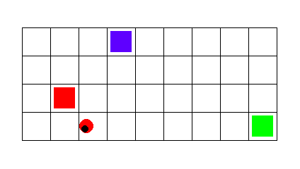
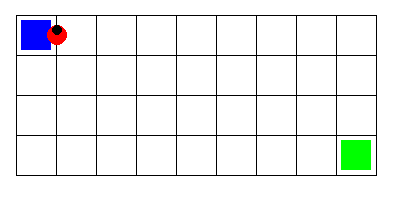
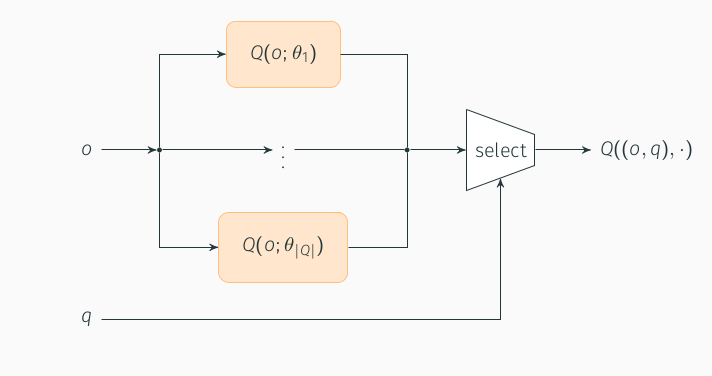
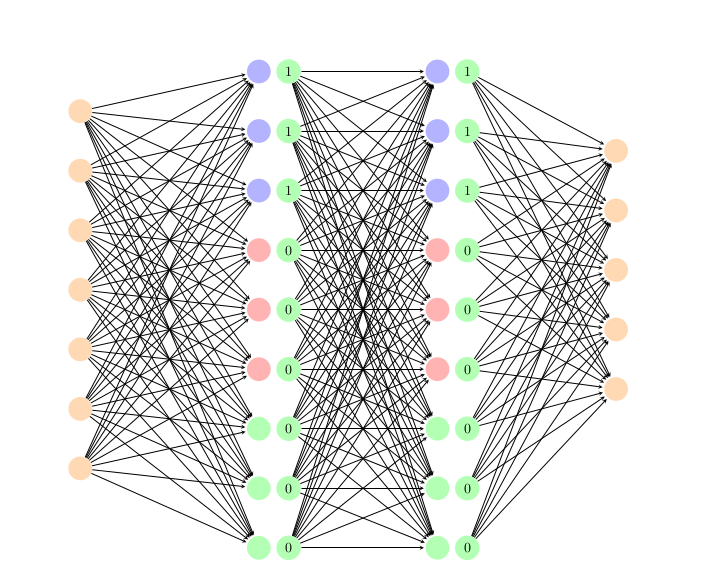

# Reasoning Agent project:
## Non markovian policy networks for LTLf/LDLf goals

This folder contains an implementation of a **non markovian policy network**  for a project whose goal is to develop a reinforcement learning agent for solving a non markovian reward decision process. The project is focused on temporal goal formulation and on showing how deep RL SOA approaches can be easily adapted to work outside a standard reinforcement learning scenario. 
We deploy the agent neural network  on **[Tensorforce 0.6.4](https://github.com/tensorforce/tensorforce)**, an open source deep reinforcement learning library based on the popular deep learning libaries *Tensorflow*  and *Keras*.  

 

The project experiments are run on  **[Gym Sapientino](https://github.com/cipollone/gym-sapientino-case)** :  a  custom **[openAI-gym](https://github.com/openai/gym)** environment which supports non markovian rewards . 
For a deeper insight of non markovian  reward description, refer to the paper
[ LTLf/LDLf Non-Markovian Rewards](https://ojs.aaai.org/index.php/AAAI/article/view/11572) which you can find also attached inside the *paper/* directory in the folder.
The agent can move in the environment which is essentially a two dimensional rectangular map in which some colored tiles represents *position of interest* the agent should visiting during the exploration of the environment.

 **[Gym Sapientino](https://github.com/cipollone/gym-sapientino-case)** has  a continuous state space and a discrete action space.

 

We present also a [pdf report](https://github.com/francycar/RA_project/blob/main/report/Reasoning_Agent.pdf) containing a small compilative survey on the main adopted technologies, as well as a comparative analysis on the experimental results obtained with different environment and agent configurations.

 

We attach also a video folder containing a series of videos showing the non markovian agent behaviour on a series of map with different goal  formulations and environment settings.

# Task description
The task consists in visiting a sequence of colored tiles in a given order in a two dimensional map. 
The color sequence is the temporal goal associated to the task.  
Below we show an example of execution in which the  goal sequence is  
G={blue,green}  

 

<figure class="video_container">
  <video controls="true" allowfullscreen="true" poster="report/images/map3_easy.png">
    <source src="video/three_colors.mp4" type="video/mp4">
    <source src="video/three_colors.ogg" type="video/ogg">
    <source src="video/thee_colors.webm" type="video/webm">
  </video>
</figure>

#  Agent description
The non markovian implementation is based on thee joint effort of multiple separate experts, each one trained to reach a different color of the goal sequence. The expert selection is determined by the color which should be visited *"next"* in the goal sequence which is an information which can be inferred by inspecting the goal DFA.

 The expert training performed using  [proximal policy optimization](https://arxiv.org/abs/1707.06347) algorithm with default parameters.

 The proposed  implementation employs a single policy network divided amongst the experts so that each portion of the network is assigned to a different expert.
This approach guarantees **convergence** on a variety of maps with different **colored tile positioning** and **goal formulation**, showing robustness to goal and task parameters variations.

#  Run the project
## Install the required packages
Open your terminal and type

`	git clone https://github.com/francycar/RA_project` 

Change the directory to the project root directory

`	cd RA_project` 

And install the required packages

`	pip install -r requirements.txt` 

## Run a training experiment
You can run the reinforcement learning experiments in both training and evaluation mode.

To train a non markovian agent that visit a two color sequence, make sure that all the required packages are installed and then type :

`	python main.py --num_colors 2 ` 

This runs the main program and train the non markovian agent to visit a 2 color sequence {blue, green} in a default map.
To modify the color sequence run 

`	python main.py --num_colors 2 --sequence [green,blue]` 

You can also train on a different map. In this case you can specify a path to the custom map

`	python main.py --num_colors 2 --sequence [green,blue] --path_to_map <path to map >`

You can specify additional training *hyperparameters* to the command line 

- --*batch_size*:  experience batch size.

- --*memory*: memory buffer size. Used by agents that train with replay buffer.

- --*max_timesteps*: maximum number of timesteps each episode.

- --*episodes*: number of training episodes.

- --*multi_step*: agent update optimization steps.

- --*update_frequency*: frequency of the policy updates. Default equals to batch_size.

- --*exploration*: exploration for the epsilon greedy algorithm.

- --*entropy_regulatization*: entropy bonus for the 'extended' loss of PPO. It discourages the policy distribution from being “too certain” (default: no entropy regularization).

- --*hidden_size*: number of neurons of the hidden layers of the network.

- --*learning_rate*: learning rate for the optimization algorithm

For a finer agent customization, you can directly modify the agent construction inside *agent_config.py* 
Refer to the **[tensorforce 0.6.4](https://github.com/tensorforce/tensorforce)** documentation for tensorforce agent construction syntax.
