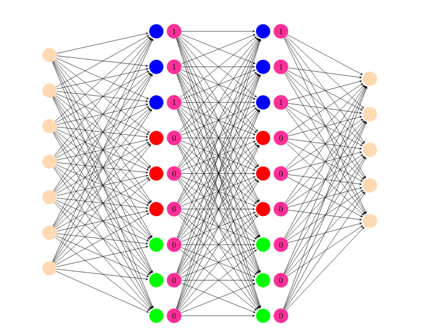

# Reasoning Agent project:
# Reasoning Agent project:
## Non markovian policy networks for LTLf/LDLf goals

This folder contains a working implementation of a non markovian policy network for an agent that solves a non markovian task. The project is based on **[tensorforce 0.6.4](https://github.com/tensorforce/tensorforce)** and **[openAI gym](https://github.com/openai/gym)** .
We use also a custom gym environment to run experiments with non markovian rewards: **[Gym Sapientino](https://github.com/cipollone/gym-sapientino-case)**.

## Task description
The task consists in visiting a sequence of colored tiles in a given order in a two dimensional map. 
The color sequence is the temporal goal that the agent should reach.

## Agent description
The non markovian implementation is based on thee joint effort of multiple separate experts, each one trained to reach a different color of the goal sequence.

 The expert training performed using  [proximal policy optimization](https://arxiv.org/abs/1707.06347) algorithm with default clipping value and no entropy regularization.

 The proposed  implementation is based uses a single policy network divided amongst the experts so that each portion of the network is assigned to a different expert.
This approach guarantees **convergence** on a variety of maps with different **colored tile positioning** and **goal formulation**, showing robustness to goal and task parameters variations.

## Install the required packages
Open your terminal and type

`	git clone https://github.com/francycar/RA_project` 

Change the directory to the project root directory

`	cd RA_project` 

And install the required packages

`	pip install -r requirements.txt` 

## Run a training experiment
You can run the reinforcement learning experiments in both training and evaluation mode.

To train a non markovian agent that visit a two color sequence, make sure that all the required packages are installed and then type :

`	python main.py --num_colors 2 ` 

This runs the main program and train the non markovian agent to visit a 2 color sequence {blue, green} in a default map.
To modify the color sequence run 

`	python main.py --num_colors 2 --sequence [green,blue]` 

You can also train on a different map. In this case you can specify a path to the custom map

`	python main.py --num_colors 2 --sequence [green,blue] --path_to_map <path to map >`

You can specify additional training *hyperparameters* to the command line

- --*batch_size*:  experience batch size.

- --*memory*: memory buffer size. Used by agents that train with replay buffer.

- --*max_timesteps*: maximum number of timesteps each episode.

- --*episodes*: number of training episodes.

- --*multi_step*: agent update optimization steps.

- --*update_frequency*: frequency of the policy updates. Default equals to batch_size.

- --*exploration*: exploration for the epsilon greedy algorithm.

- --*entropy_regulatization*: entropy bonus for the 'extended' loss of PPO. It discourages the policy distribution from being “too certain” (default: no entropy regularization.

- --*hidden_size*: number of neurons of the hidden layers of the network.

- --*learning_rate*: learning rate for the optimization algorithm

For a finer agent customization, you can directly modify the agent construction inside *agent_config.py* 
Refer to the **[tensorforce 0.6.4](https://github.com/tensorforce/tensorforce)** documentation for tensorforce agent construction syntax.

## Run an evaluation experiment
As we already mentioned, we released two pretrained agents for the two and three colors respecively as a showcase. You can run these agents in evaluation typing:

`	python run.py --num_colors <number of colors. Can be in {2,3}> `

Using the same syntax described for the training process you specify *max_timestep* and *episodes* parameters for the evaluation.

